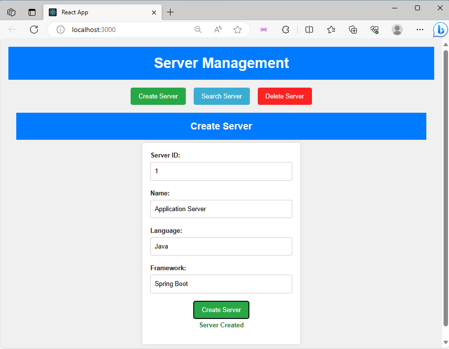
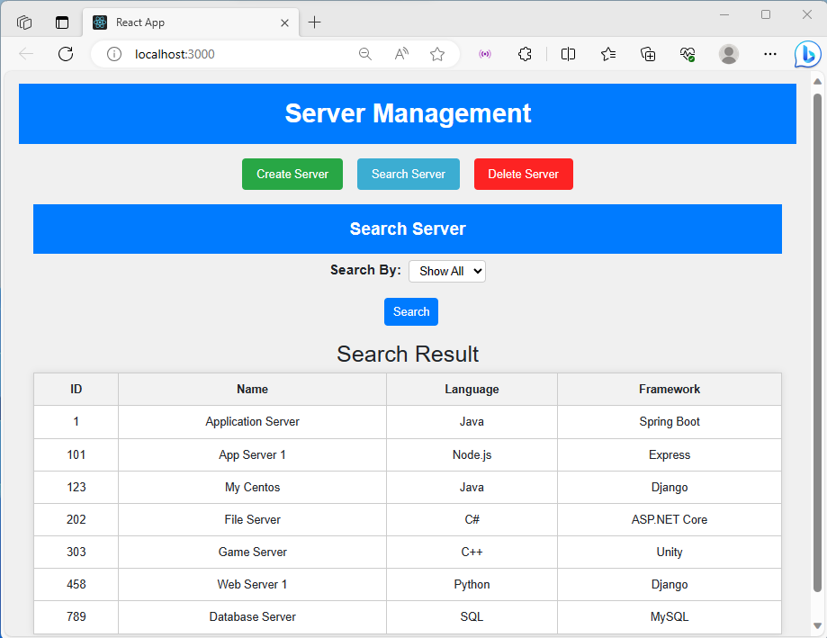
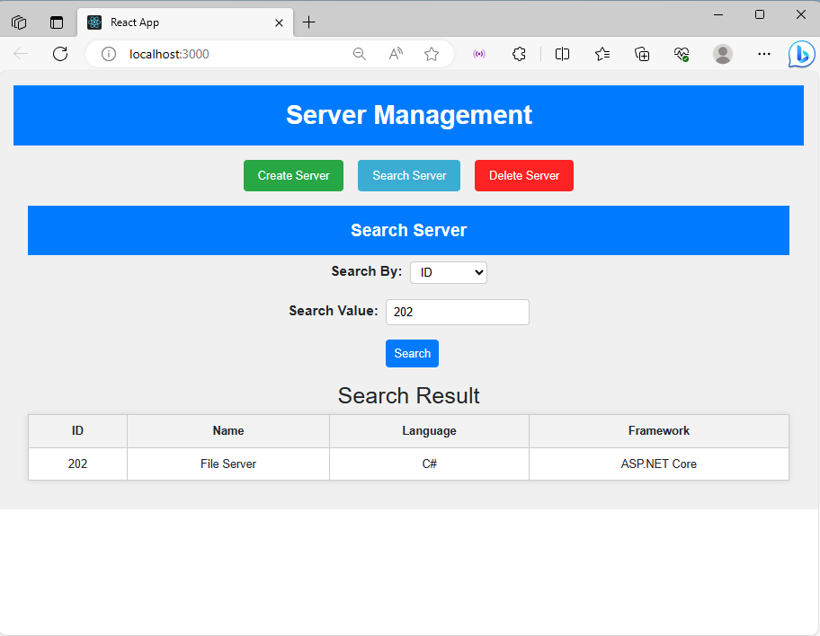
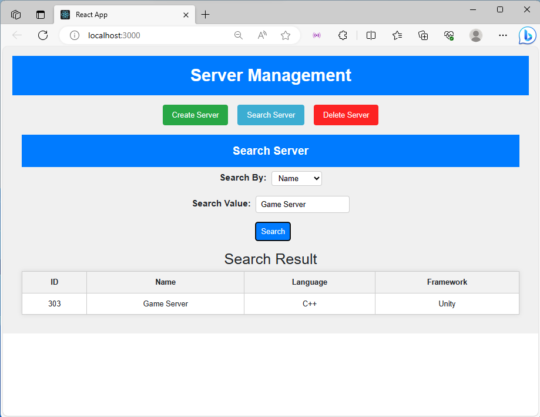
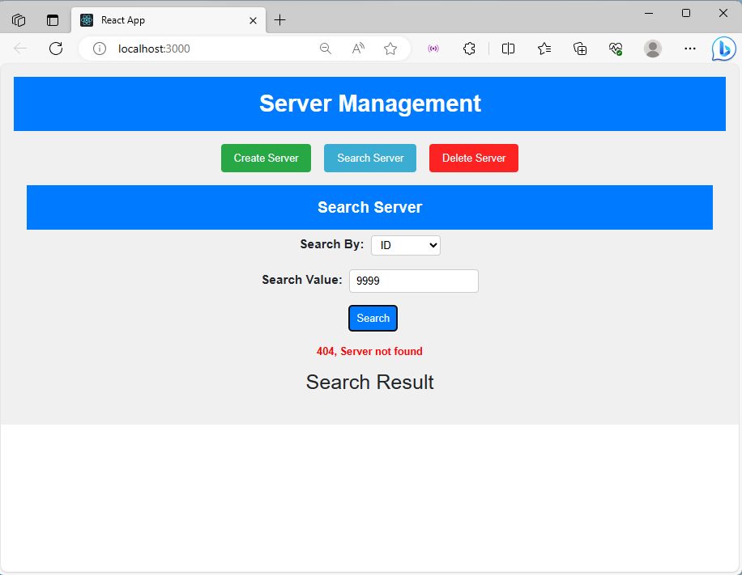
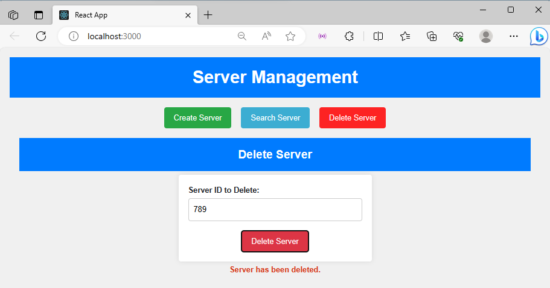

# Task 4. WEB UI Forms

This is a simple web-based User Interface (UI) for managing servers using a RESTful API. The UI provides three main functionalities:

1. **Create Server**: This feature allows to create a new server by providing the server's ID, name, language, and framework. Upon creation, a success message is displayed.

2. **Search Server**: You can search for servers using various criteria:
   - **Search by ID**: Enter a server ID to retrieve detailed information about a specific server.
   - **Search by Name**: Enter a server name to search for servers with matching names.
   - **Show All Servers**: View a list of all servers in the database.

3. **Delete Server**: This feature enables to delete a server by providing its ID. Upon successful deletion, a success message is displayed.

## Usage

To use this UI, follow these steps:

1. Clone the project repository to your local machine.

2. Install the necessary dependencies using npm or yarn:

   ```
   npm install
   # or
   yarn install
   ```


3. Start the development server:
    ```
    npm start
    # or
    yarn start
    ```

4. Access the UI by opening your web browser and navigating to http://localhost:3000.

## Screenshots

### Create Server

Screenshot: Create a new server with details.

### Search Server - ShowAll

Screenshot: Show all servers.

### Search Server By Id


Screenshot: Search for servers by ID.

### Search Server By Name

Screenshot: Search for servers Name.

### Search Server - Server Not Found

Screenshot: Server do not exists.

### Delete Server

Screenshot: Delete a server by providing its ID.

## Technologies Used
- React.js: Frontend framework for building the UI.
- Axios: HTTP client for making API requests.
- CSS: Styling the UI components.
- Other libraries and tools as needed.

## API Integration
This UI is designed to work with a backend server that provides the required RESTful API endpoints for server management. Ensure that the backend server is running and accessible for full functionality.